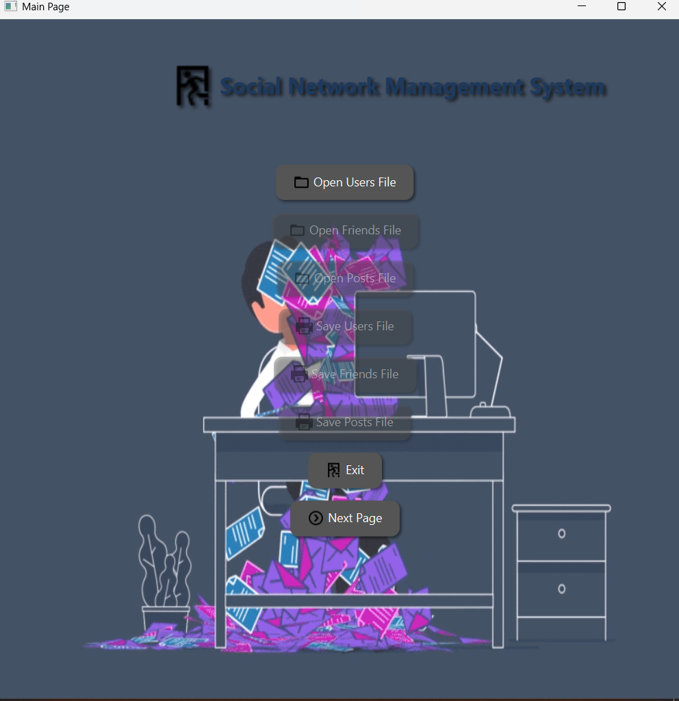
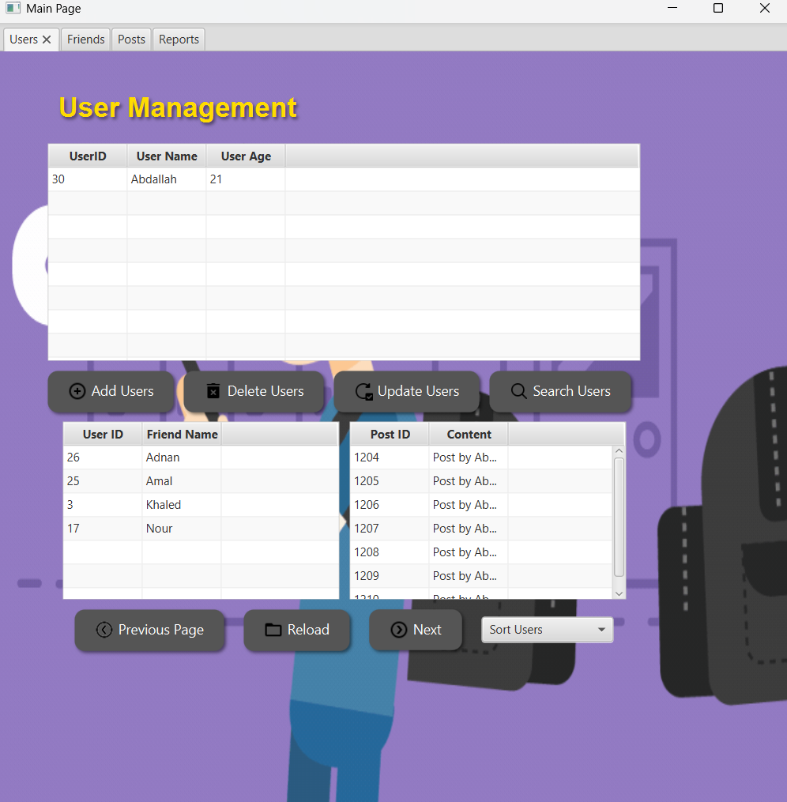
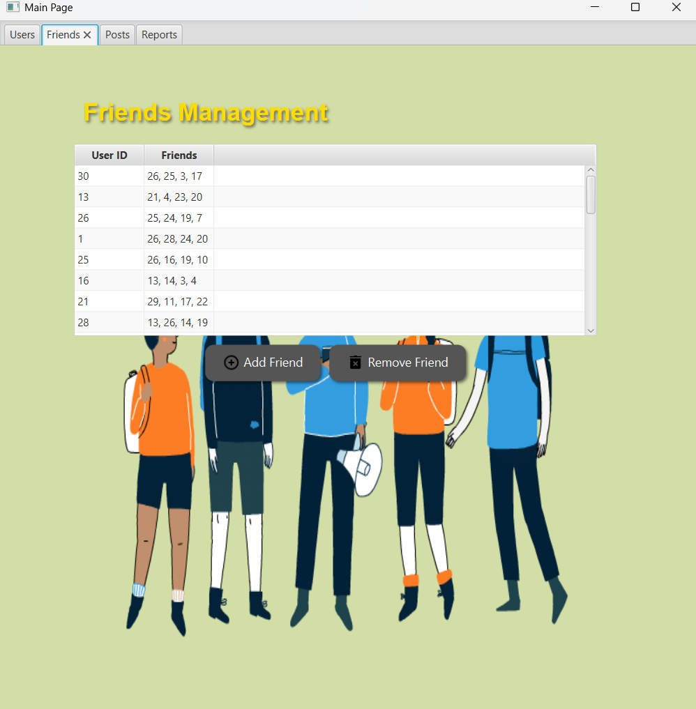
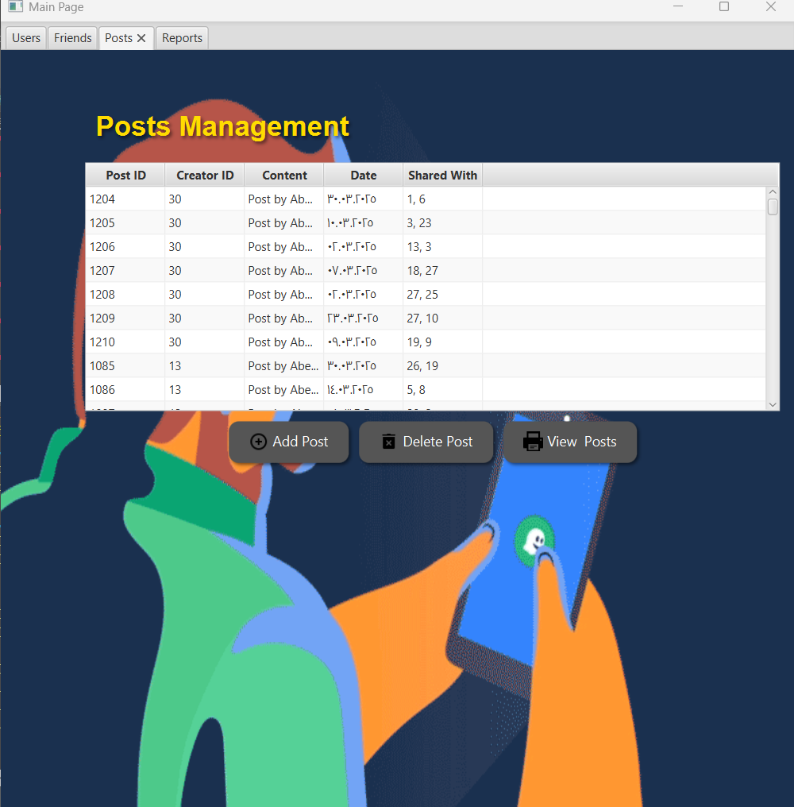

# 👥 Social Network Manager (Linked List)

Java application that manages a simple social network using singly and doubly linked lists.  
Developed for the **COMP242 – Data Structures** course at **Birzeit University**.

---

## 🚀 Features
- Add, remove, and search for users
- Manage user connections (friendships)
- Display user info and linked connections
- Java console-based interface

---

## 📚 Data Structures Used
- Singly Linked List
- Doubly Linked List

---

## 🖼️ Interface Screenshots

| Main Page | User Page |
|-----------|-----------|
|  |  |

| Friends Page | Posts Page |
|--------------|------------|
|  |  |

---

## 👨‍💻 Developed By
**Mahmoud Kafafi**  
Spring 2025 — COMP242 — Birzeit University
