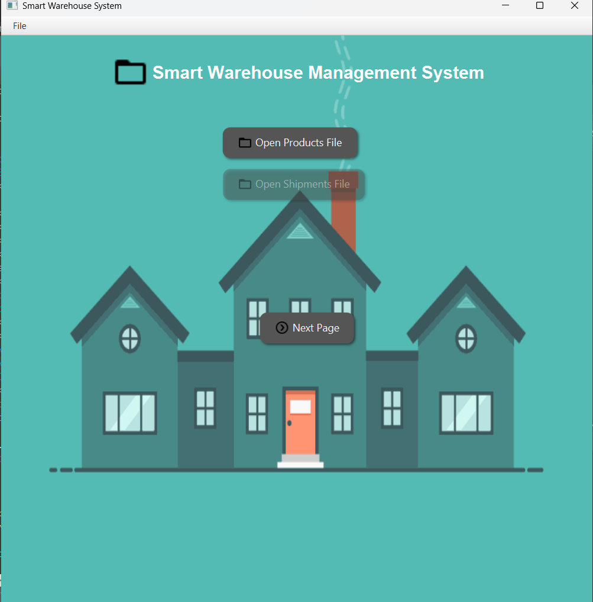
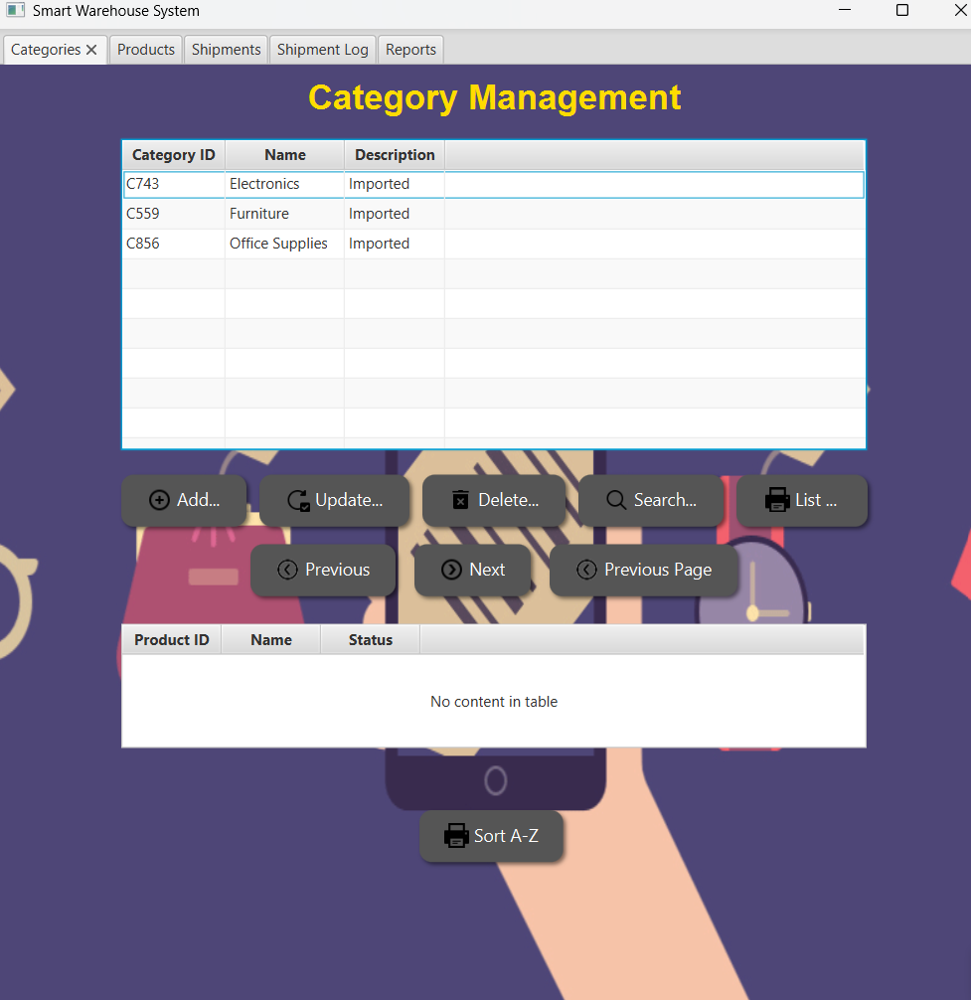
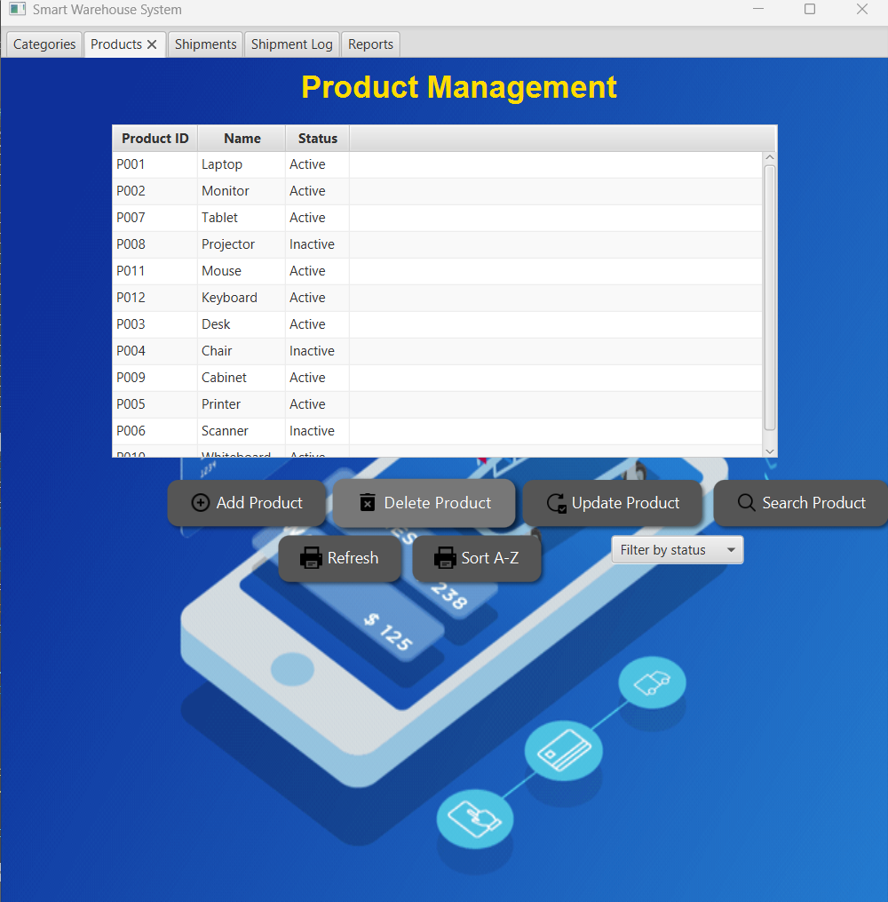
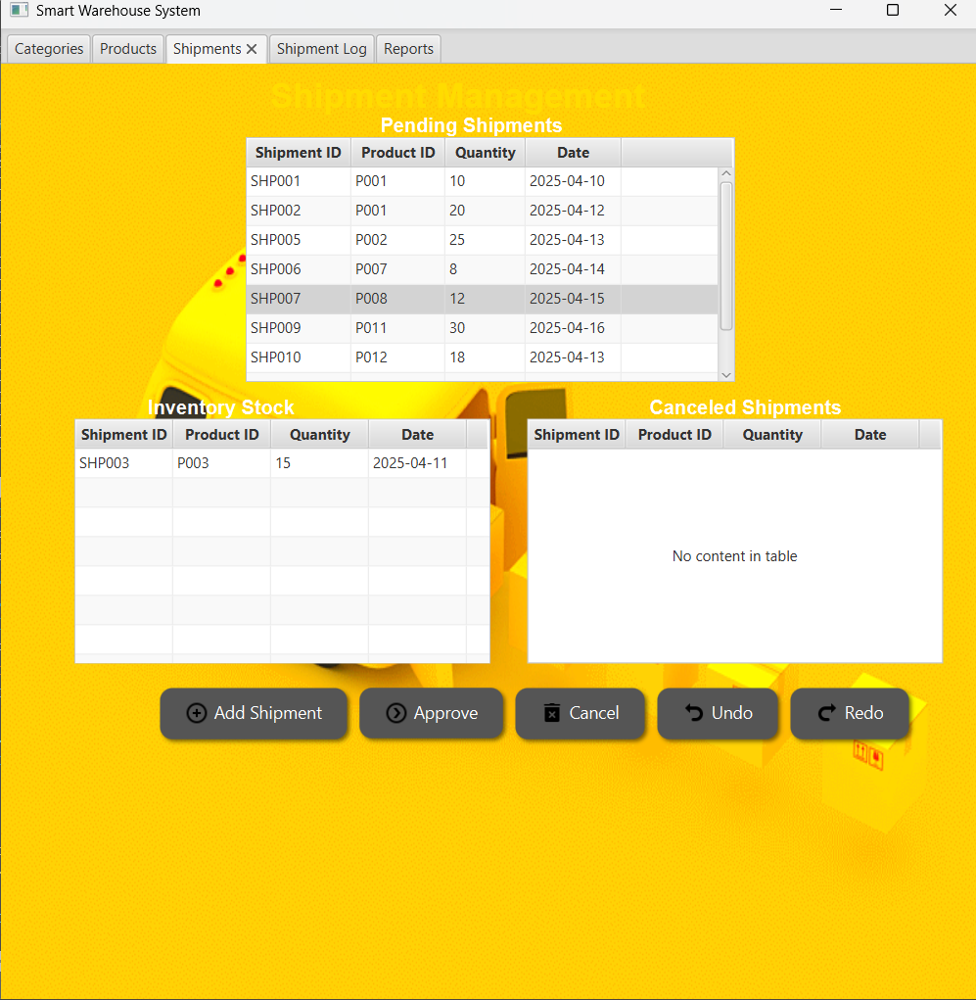
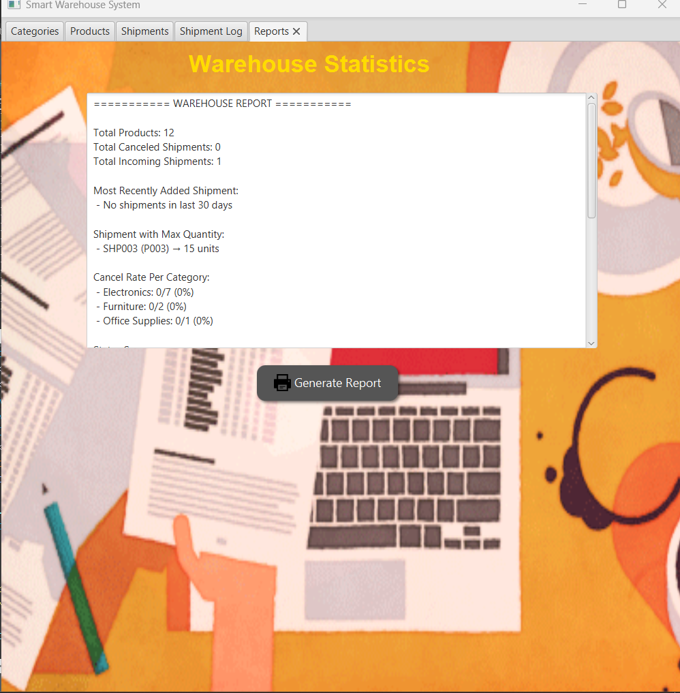
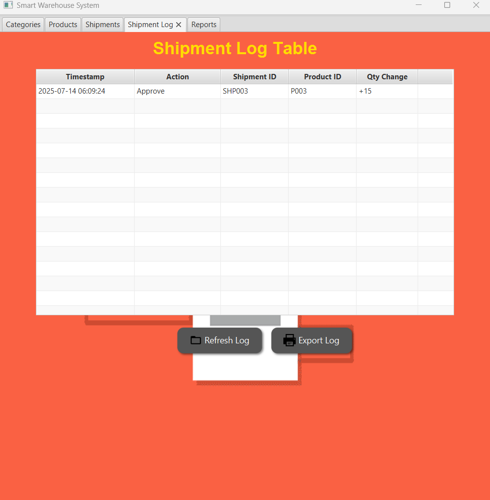

# 🏭 Smart Warehouse Inventory System – JavaFX Project

This project simulates a smart warehouse management system that handles product categories, inventory updates, and shipment processing.  
It was developed using JavaFX and advanced Data Structures (Linked List, Queue, Stack, Cursor Implementation).

---

## 🧠 Key Features

- 📦 Add / Update / Delete categories and products
- 📤 Approve and cancel shipments
- 🔁 Undo & Redo product stock changes
- 📂 Log stock changes and history
- 🧭 Cursor-based list to simulate static memory
- 🎨 JavaFX UI for visual interaction

---

## 📚 Data Structures Used

- **Doubly Linked List** → Product and shipment lists  
- **Cursor-based Linked List** → Simulates array-based list  
- **Queue** → Pending shipments  
- **Stack** → Undo/Redo actions

---

## 🖼️ UI Screenshots

| Page | Preview |
|------|---------|
| 🏠 Main Page |  |
| 📁 Categories |  |
| 📦 Products |  |
| 🚚 Shipments |  |
| 📑 Reports |  |
| 📜 Log File |  |

---

## 👨‍💻 Developed By

**Mahmoud Kafafi**  
COMP242 – Data Structures  
Birzeit University – Spring 2025
