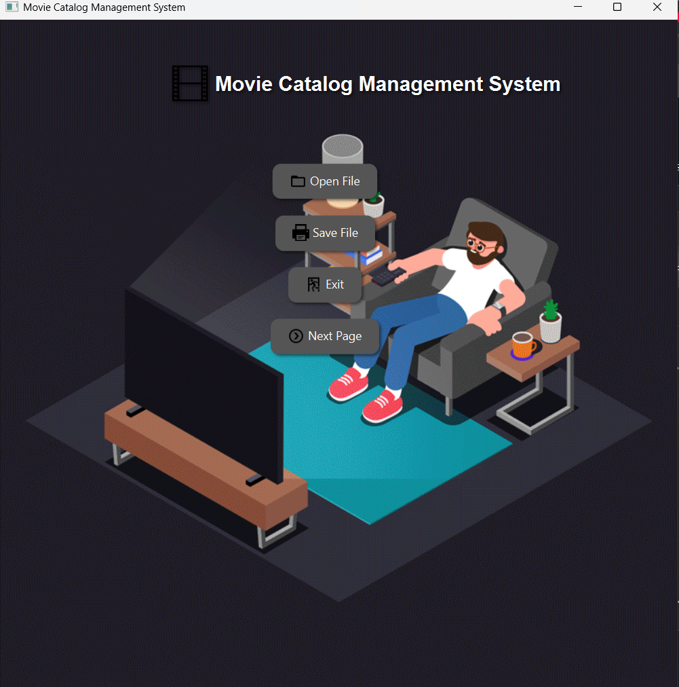
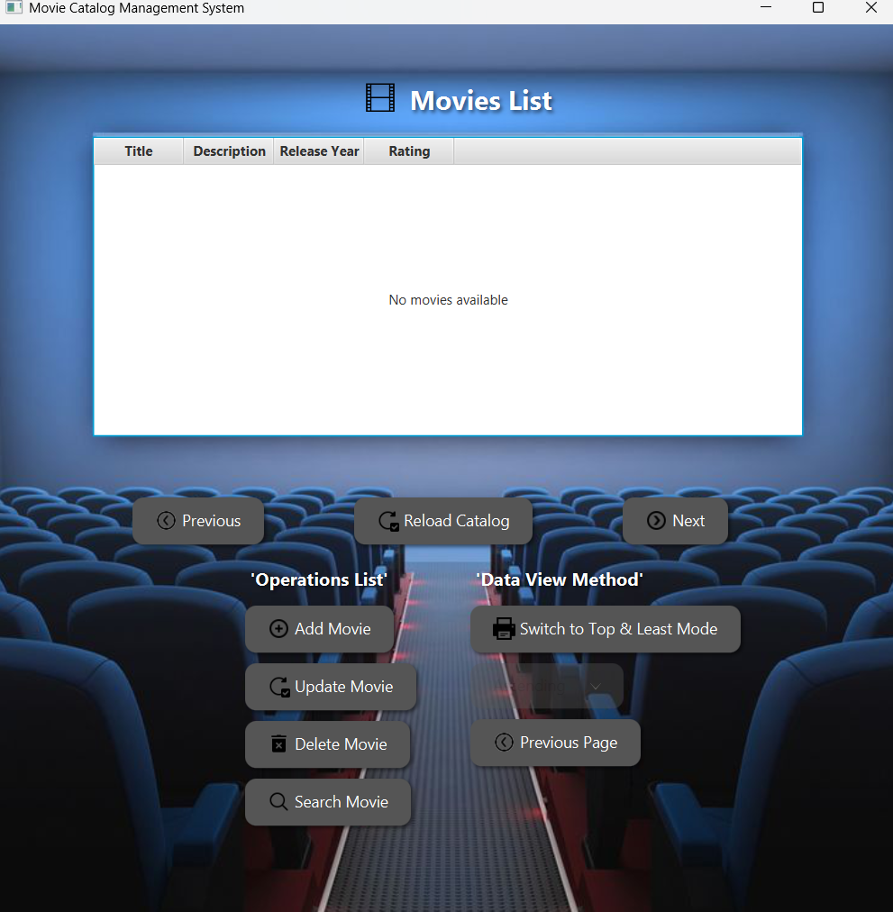

# 🎬 Movie Catalog Manager – Hash Table + AVL Trees

This project manages a collection of movies using a Hash Table for indexing and AVL Trees for resolving collisions.  
It was developed as part of the Data Structures course (COMP242) at Birzeit University.

---

## 🧠 Features

- 🎞️ Add / Delete / Search movies by title
- 🔄 Handle collisions using AVL trees
- 🧮 Efficient Hashing using modulo index
- 📂 View movies by hash slot and sorted order
- 🧠 AVL Tree used for balanced collision resolution
- 🎨 JavaFX interface for user interaction

---

## 📚 Data Structures Used

- **Hash Table** (Closed Addressing with AVL Trees)
- **AVL Tree** (self-balancing binary search tree)

---

## 🖼️ Interface Screenshots

| Page         | Preview                         |
|--------------|----------------------------------|
| Main Page    |  |
| Search Page  |  |

---

## 👨‍💻 Developed By

**Mahmoud Kafafi**  
COMP242 – Data Structures  
Birzeit University – Spring 2025
